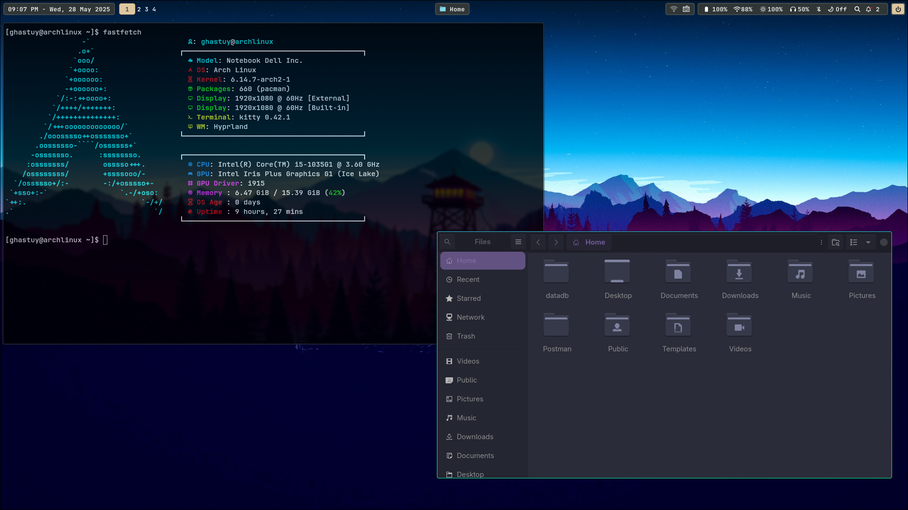

## Hyprland configuration
## Important Notes: 
- #: su (super user)
- $: normal user
- Font use: (JetBrainsMono Nerd Font)[https://www.nerdfonts.com/font-downloads]
- (Install Font)[https://wiki.archlinux.org/title/Fonts], follow the ```2.3 Manual installation``` (Subject may change but the wiki always has this section).
## Installation:
1. Install package from list using this command.
```
# pacman -S --needed $(comm -12 <(pacman -Slq | sort) <(sort pkglist.txt))
```
2. Install [yay](https://github.com/Jguer/yay)
3. Next install AUR packages.
```
$ yay -S --needed - < foreignpkglist.txt
```
4. Copy folder ```.icons``` and ```.themes``` to ```~``` 
```
$ cp -r .icons/ ~
$ cp -r .themes/ ~
```
## Pictures
<picture>
    
</picture>

## Thanks for using it